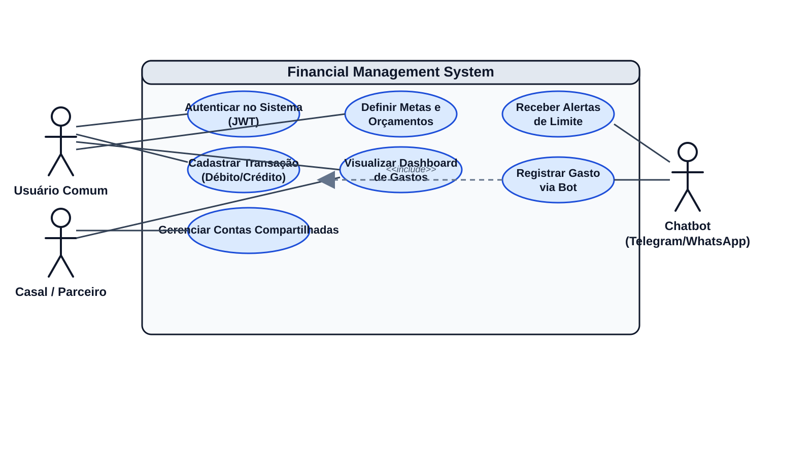

# Financial Management

Sistema de gestão financeira pessoal e compartilhada, orientado a lançamentos, acompanhamento de saldos, categorização simples, recorrência, transferências entre contas e integração por bot.

Este README consolida o escopo do MVP, as regras de negócio centrais, os fluxos principais de uso e os limites funcionais do produto.

## Status atual do projeto

O projeto já possui uma base backend funcional em evolução, com domínio financeiro, autenticação JWT, APIs REST principais e métricas iniciais de dashboard.

### Backend já implementado

- modelagem relacional inicial com Flyway para usuários, contas, categorias, tags, transações e compartilhamento de contas;
- entidades JPA com mapeamento para PostgreSQL;
- repositories Spring Data JPA para o domínio principal;
- camada de service para transações, dashboard e gestão de usuários;
- soft delete em transações;
- auditoria com `criado_em`, `atualizado_em` e triggers de atualização no banco;
- autenticação JWT com Spring Security;
- endpoint de login;
- endpoints REST iniciais para usuários, transações e dashboard;
- tratamento global de erros de validação com `MethodArgumentNotValidException`.

### Em andamento / próximo ciclo

- consolidação da camada frontend;
- integração visual com a API protegida por JWT;
- cobertura de testes de unidade e integração;
- evolução do modelo para recorrência real, transferências explícitas e fechamento mensal.

## Stack atual

### Backend

- Java 17
- Spring Boot
- Spring Data JPA
- Spring Security com JWT
- Flyway
- PostgreSQL
- Lombok

### Frontend planejado

- AngularJS
- Tailwind CSS
- Chart.js

### Integrações planejadas

- WhatsApp / Telegram via n8n

## Objetivo do MVP

Entregar uma base funcional para controle financeiro moderno com foco em:

- registro rápido de transações;
- atualização confiável de saldos, inclusive em lançamentos retroativos;
- uso individual e compartilhado de contas;
- classificação simples por categoria principal e tags customizadas;
- suporte inicial a recorrência e transferências;
- entrada e alerta de gastos por bot via WhatsApp/Telegram com orquestração em n8n.

## Escopo funcional

O MVP contempla os seguintes blocos de negócio:

- autenticação do usuário no sistema;
- cadastro e gestão de contas financeiras;
- contas compartilhadas entre múltiplos usuários;
- lançamento manual de despesas, receitas e movimentações financeiras;
- classificação por categorias principais e tags livres;
- transações recorrentes;
- transferências entre contas com atualização dupla de saldo;
- dashboard de gastos e relatórios por conta e por usuário;
- alertas de limite e registro de gastos via bot.

## Entregas já realizadas

### 1. Banco de dados e persistência

- migrations Flyway iniciais para estrutura base do domínio financeiro;
- coluna de soft delete em `transacoes`;
- evolução de auditoria com `atualizado_em` para transações;
- índices principais para consultas por usuário, conta, categoria e data.

### 2. Domínio e regras de negócio

- entidades `Usuario`, `Conta`, `Categoria`, `Tag`, `Transacao`, `ContaUsuario` e chave composta `ContaUsuarioId`;
- regra de saldo em `TransacaoService`, incluindo estorno em exclusão;
- métricas consolidadas em `DashboardService`;
- gestão de usuários em `UsuarioService`.

### 3. API REST já disponível

- cadastro e consulta de usuários;
- login e geração de token JWT;
- criação, consulta e exclusão lógica de transações;
- consulta de dashboard mensal por usuário.

### 4. Segurança

- autenticação com Spring Security;
- login com `AuthenticationManager`;
- filtro JWT para requisições autenticadas;
- autorização stateless;
- criptografia de senha com `BCryptPasswordEncoder`.

## Atores e canais

| Ator | Papel no sistema | Canais principais |
| --- | --- | --- |
| Usuário Comum | Registra lançamentos, consulta saldo, acompanha metas e alertas | Web / Mobile / Bot |
| Casal / Parceiro | Compartilha contas e acompanha contribuição individual | Web / Mobile |
| Bot | Recebe comandos de lançamento e envia alertas proativos | WhatsApp / Telegram via n8n |

## Regras de negócio centrais

### 1. Saldos e fechamento de mês

- O histórico de transações é a fonte de verdade financeira da conta.
- O campo de saldo atual deve ser tratado como projeção operacional para leitura rápida, nunca como substituto do razão de lançamentos.
- Qualquer inclusão, alteração ou exclusão retroativa deve recalcular os efeitos da data impactada em diante.
- Meses fechados continuam consultáveis, mas alterações e exclusões exigem confirmação explícita em tela.
- O fechamento mensal do MVP deve funcionar como bloqueio lógico com double-check, reduzindo mudanças acidentais em períodos já conciliados.

### 2. Contas compartilhadas

- O sistema suporta relação N:N entre usuários e contas.
- Uma conta pode pertencer a mais de um usuário e um usuário pode participar de múltiplas contas.
- Cada transação registra o usuário autor do lançamento, permitindo relatórios consolidados e também relatórios por contribuição individual.
- O conjunto mínimo de permissões do MVP deve contemplar ao menos `DONO` e `LEITURA`.
- A visão compartilhada da conta não elimina a rastreabilidade individual de quem lançou cada movimentação.

### 3. Tipos de conta do MVP

Os tipos operacionais previstos para contas são:

- `DEBITO`: conta corrente, carteira digital ou saldo com baixa imediata.
- `CREDITO`: meio de pagamento com consumo de limite, sem modelagem completa de fatura no MVP.
- `VOUCHER`: saldo segregado para benefícios como vale-alimentação ou vale-refeição.
- `ESPECIE`: dinheiro físico.

### 4. Transações recorrentes

- O sistema deve suportar recorrências como semanal, quinzenal, mensal, bimestral, trimestral, semestral e anual.
- A recorrência deve representar uma regra geradora de ocorrências, e não apenas uma marca booleana em lançamentos isolados.
- Cada ocorrência gerada precisa virar uma transação real no extrato da conta.
- Alterações em recorrência devem considerar, no mínimo, os cenários: apenas esta ocorrência ou próximas ocorrências.
- Cancelar uma recorrência interrompe novas gerações, mas não remove automaticamente lançamentos já materializados.

### 5. Transferências entre contas

- Transferência é uma única ação na interface, mas gera dois efeitos financeiros sincronizados.
- Toda transferência deve debitar a conta de origem e creditar a conta de destino com o mesmo valor absoluto.
- Os dois movimentos precisam permanecer vinculados por um identificador comum de operação.
- Transferências não devem distorcer relatórios de receita e despesa operacional.
- A consistência da operação exige persistência atômica dos dois lados da movimentação.

### 6. Categorização

- O modelo de classificação do MVP é propositalmente plano.
- Cada transação deve ter uma categoria principal obrigatória.
- Tags são opcionais, livres e podem ser múltiplas por transação.
- Categorias representam o agrupamento macro de análise, por exemplo `Alimentação`.
- Tags representam contexto fino e customizado, por exemplo `#ifood`, `#mercado`, `#restaurante`.
- O MVP não contempla subcategorias hierárquicas.

### 7. Integração e autenticação do bot

- O bot opera em dois modos: ativo e passivo.
- No modo passivo, recebe mensagens e comandos de lançamento enviados pelo usuário.
- No modo ativo, envia alertas de orçamento, saldo e eventos relevantes.
- A autenticação primária do usuário no bot é baseada no número de telefone.
- O n8n atua como camada de orquestração de webhook, normalização de payload, roteamento e envio de mensagens.
- O backend deve ser a fonte de identidade, autorização e persistência das operações recebidas via bot.
- O fluxo mínimo do MVP é:

    1. a mensagem chega ao canal externo;
    2. o n8n recebe o evento e normaliza o payload;
    3. o sistema localiza o usuário pelo telefone cadastrado;
    4. o backend valida vínculo, permissão e intenção da ação;
    5. a transação é persistida no sistema;
    6. a resposta é enviada ao usuário com confirmação ou orientação de correção.

## Fluxos principais do usuário

### Lançamento manual

1. O usuário escolhe a conta.
2. Informa valor, data, categoria e detalhes opcionais.
3. O sistema grava a transação e atualiza o saldo da conta.
4. Se a data for retroativa, o recálculo é aplicado a partir da competência impactada.
5. Se o período estiver fechado, o sistema exige confirmação explícita antes de concluir a alteração.

### Transação recorrente

1. O usuário cria uma regra recorrente com frequência, início e opcionalmente fim.
2. O sistema gera ocorrências futuras conforme a agenda configurada.
3. Cada ocorrência vira um lançamento real no extrato.
4. O usuário pode ajustar uma ocorrência isolada sem necessariamente alterar toda a série.

### Transferência entre contas

1. O usuário escolhe origem, destino, valor e data.
2. O sistema cria uma única operação lógica de transferência.
3. O backend persiste os dois lançamentos vinculados na mesma transação de banco.
4. Os saldos das duas contas são atualizados de forma consistente.

### Lançamento via bot

1. O usuário envia uma mensagem ao bot.
2. O n8n recebe o webhook do provedor de mensageria.
3. O sistema identifica o usuário pelo número de telefone.
4. O backend interpreta a solicitação e cria o lançamento.
5. O bot devolve confirmação, erro de validação ou alerta contextual.

## Limites do MVP

Para manter foco e velocidade de entrega, o MVP não cobre neste primeiro ciclo:

- hierarquia de categorias;
- parcelamento e ciclo completo de fatura para contas de crédito;
- multi-moeda e conversão cambial;
- importação automática de extrato bancário ou Open Finance;
- conciliação bancária avançada;
- divisão de uma única transação em múltiplas categorias;
- NLP avançado no bot além de comandos e padrões bem definidos.

## Estado atual da API

### Endpoints disponíveis

| Método | Rota | Objetivo |
| --- | --- | --- |
| `POST` | `/api/v1/usuarios` | cadastrar usuário |
| `GET` | `/api/v1/usuarios/{id}` | buscar usuário por id |
| `POST` | `/api/v1/auth/login` | autenticar e gerar JWT |
| `POST` | `/api/v1/transacoes` | criar transação |
| `GET` | `/api/v1/transacoes/usuario/{usuarioId}` | listar transações por usuário |
| `DELETE` | `/api/v1/transacoes/{id}` | excluir transação via soft delete |
| `GET` | `/api/v1/dashboard/usuario/{usuarioId}?mes={mes}&ano={ano}` | consultar dashboard mensal |

### Regras atuais de segurança

- rotas públicas: `POST /api/v1/usuarios` e `POST /api/v1/auth/login`;
- demais rotas exigem token JWT válido;
- autenticação baseada no e-mail do usuário;
- senha armazenada com hash BCrypt.

## Aderência ao modelo de dados do MVP

O modelo relacional atual já cobre parte importante do domínio, mas o Definition of Done do MVP exige algumas evoluções adicionais para refletir integralmente as regras abaixo.

| Tema | Cobertura atual no banco | Ação recomendada para aderência completa |
| --- | --- | --- |
| Saldos e retroativos | `contas` e `transacoes` sustentam saldo e histórico | adicionar mecanismo de fechamento mensal e recálculo por período impactado |
| Contas compartilhadas | `contas_usuarios` + `transacoes.usuario_id` já suportam autoria e compartilhamento | manter relatórios por usuário e reforçar domínio de permissões |
| Tipos de conta | `contas.tipo` já existe | restringir domínio para `DEBITO`, `CREDITO`, `VOUCHER`, `ESPECIE` |
| Recorrência | `transacoes.recorrente` cobre apenas uma marcação simples | criar tabela ou entidade própria de recorrência |
| Transferências | ainda não há modelagem explícita da operação vinculada | criar agrupador técnico ou tabela dedicada para transferência |
| Categorias e tags | `categorias`, `tags` e `transacao_tags` já suportam o modelo plano | manter categoria obrigatória e múltiplas tags opcionais |
| Bot | `usuarios.telefone` suporta identificação primária | criar vínculo de canal, trilha de integração e política de autenticação do bot |

## Roadmap imediato

O backlog atual do projeto, conforme o kanban compartilhado, aponta o próximo ciclo principal no frontend.

### Pendências priorizadas

| Issue | Tipo | Entrega |
| --- | --- | --- |
| `#12` | Frontend | configuração do AngularJS, Tailwind CSS e base layout |
| `#13` | Frontend | tela de login e integração com segurança JWT |
| `#14` | Frontend | tela de dashboard e integração com Chart.js |
| `#15` | Frontend | tela de extrato e exclusão de transações |
| `#16` | Frontend | formulário de cadastro de transação |

### Dependências funcionais do próximo ciclo

- consumir a autenticação JWT já disponível no backend;
- integrar a consulta de dashboard mensal;
- consumir criação e exclusão lógica de transações;
- estruturar navegação autenticada e layout base.

## Critérios de aceite do MVP

O MVP será considerado aderente quando:

- as regras de saldo, fechamento, compartilhamento, recorrência, transferência, categorização e bot estiverem formalizadas e implementáveis;
- os fluxos principais de usuário estiverem claros e documentados;
- os limites do produto estiverem explícitos;
- o MER e as migrations refletirem as regras de negócio centrais, sem ambiguidades entre modelo funcional e modelo técnico.

## Documentação visual

- Fonte editável do diagrama: [docs/diagrama-casos-de-uso.drawio](docs/diagrama-casos-de-uso.drawio)
- Imagem exportada: [docs/diagrama-casos-de-uso.svg](docs/diagrama-casos-de-uso.svg)

## Estrutura atual do repositório

- `backend/`: aplicação Java com Spring Boot, JPA/Hibernate, Spring Security e migrations Flyway.
- `backend/src/main/java/com/financial/management/api/`: controllers, DTOs e tratamento de exceções da API.
- `backend/src/main/java/com/financial/management/domain/`: entidades, repositories e services do domínio.
- `backend/src/main/java/com/financial/management/security/`: configuração de segurança, JWT e autenticação.
- `backend/src/main/resources/db/migration/`: migrations oficiais do banco no classpath do backend.
- `frontend/`: camada frontend ainda não iniciada no repositório atual; backlog definido no kanban.
- `database/`: arquivos auxiliares e rascunhos de modelagem fora do classpath da aplicação.
- `docs/`: documentação visual e diagramas.

## Próximos passos recomendados

- iniciar a Issue `#12` para estruturar o frontend com AngularJS, Tailwind CSS e base layout;
- integrar a tela de login com o fluxo JWT já exposto pelo backend;
- implementar a tela de dashboard usando o endpoint mensal já disponível;
- implementar o fluxo de extrato e exclusão lógica de transações;
- evoluir o MER para cobrir fechamento mensal, recorrência e transferência como conceitos explícitos;
- criar testes de unidade e integração para segurança, dashboard e regras de saldo;
- detalhar o contrato de integração do bot com o backend e o n8n.